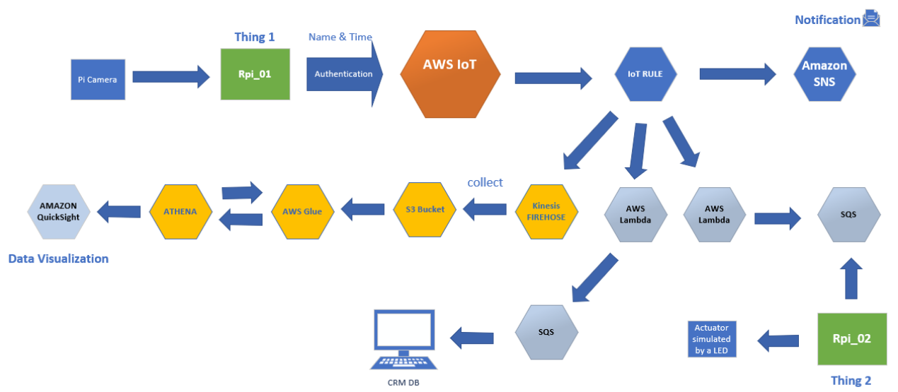

# AdvancedClock_in_System

1. The first part describes the face data gathering and recognition (Thing 1).

2. The second part looks at the AWS IoT MQTT and Amazon SNS microservice that provides a messaging service.

3. The third part describes use of Lambda function that triggers an event and
sends a message to SQS queue that is accessed by the second Raspberry Pi (opens a door simulated by a LED).
4. Part four describes the visualisation with the Amazon Quick Sight. Kinesis Firehose creates a pipeline between the MQTT client and microservices used for storage such as S3 Bucket, AWS Glue used for data transformation and Athena which is an interactive query service that makes it easier to analyse the data in S3 Bucket. Athena is also used as a
pipeline to connect to Amazon Quick Sight that further analyse and visualise the data in different chart formats.

4. Part five (not implemented) uses AWS Lambda and SQS queue to
manage the data that can be accessed by a registered CRM system.

Technology:
- AWS:
- IoT Core
- IoT Rules
- Amazon SNS
- AWS Lambda
- SQS
- Kinesis Firehose
- S3
- AWS glue
- Athena
- Amazon QuickSight 

Software:
- Python 
- OpenCV

Hardware: 
- computer to train the model 
- Raspberry pi x2 
- Grove pi
- Pi camera
- LED

